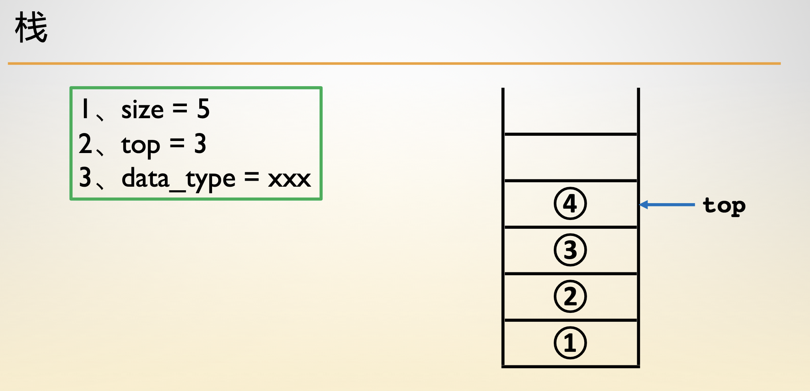
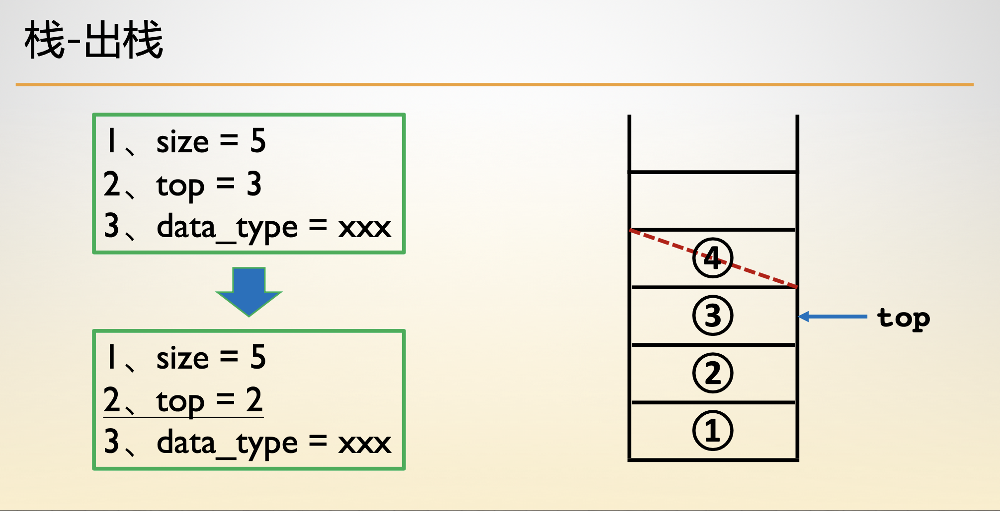
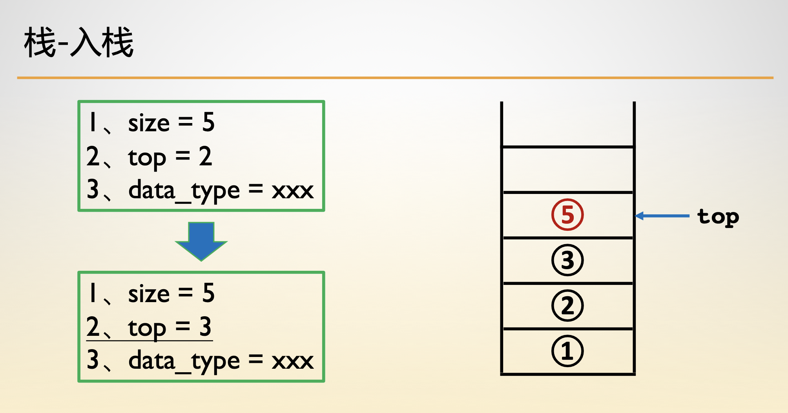
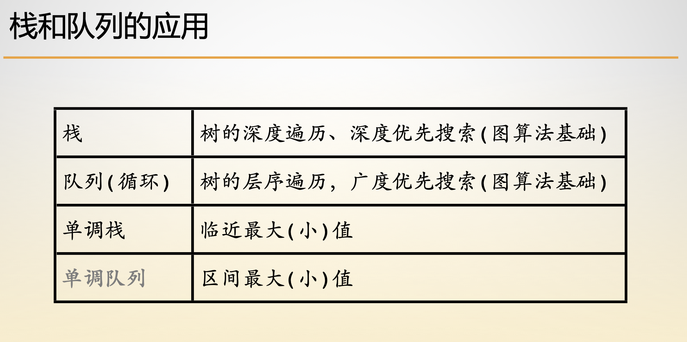

- [栈的结构](#栈的结构)
- [栈的构建](#栈的构建)
- [出栈操作](#出栈操作)
- [入栈操作](#入栈操作)
- [队列和栈的应用](#队列和栈的应用)

## 栈的结构

```c
typedef struct Stack {
    int *data;
    int top, length;
} Stack;
```

## 栈的构建



```c
Stack *init(int n) {
    Stack *s = (Stack *)malloc(sizeof(Stack));
    s->data = (int *)malloc(sizeof(int) * n);
    s->top = -1;
    s->length = n;
    return s;
}
```

## 出栈操作



```c
void pop(Stack *s) {
    if (empty(s)) return;
    s->top -= 1;
    return ;
}
```

## 入栈操作



```c
void push(Stack *s, int val) {
    if (s->top == s->length - 1) return ;
    s->top += 1;
    s->data[s->top] = val;
    return ;
}
```

## 队列和栈的应用




