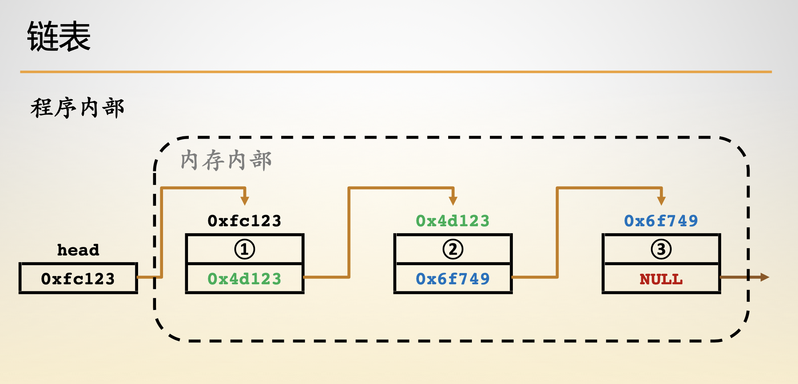
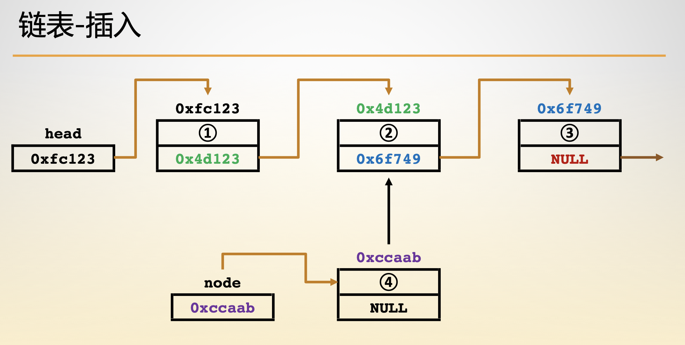
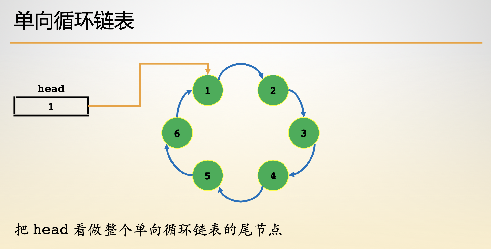

- [链表结构](#链表结构)
- [链表构建](#链表构建)
- [链表插入](#链表插入)
- [链表遍历](#链表遍历)
- [链表删除](#链表删除)
- [链表反转](#链表反转)

## 链表结构

```c
typedef struct LinkListNode {
    int data;
    struct LinkListNode *next;
} LinkListNode;

typedef struct LinkList {
    LinkListNode head;
    int length;
} LinkList;
```


## 链表构建



```c
LinkListNode *getNewNode(int val) {
    LinkListNode *p = (LinkListNode *)malloc(sizeof(LinkListNode));
    p->data = val;
    p->next = NULL;
    return p;
}

LinkList *getNewList() {
    LinkList *l = (LinkList *)malloc(sizeof(LinkList));
    l->head.next = NULL;
    l->length = 0;
    return l;
}
```

## 链表插入

1. 定义一个用于遍历的变量，初始指向头结点。
2. 输出遍历变量所在结点的值，并更新遍历变量为当前结点的下一个结点。
3. 重复操作 2，直到遍历完所有结点。



```c
int insert(LinkList *l, int ind, int val) {
    if (ind < 0 || ind > l->length) return 0;
    LinkListNode *p = &(l->head), *new_node = getNewNode(val);
    while (ind--) p = p->next;
    new_node->next = p->next;
    p->next = new_node;
    l->length += 1;
    return 1;
}
```

## 链表遍历

1. 定义一个用于遍历的变量，初始指向头结点。
2. 输出遍历变量所在结点的值，并更新遍历变量为当前结点的下一个结点。
3. 重复操作 2，直到遍历完所有结点。



```c
void output(LinkList *l) {
    printf("\033[31mhead\033[0m -> ");
    LinkListNode *p = l->head.next;
    while(p) {
        printf("\033[33m%d\033[0m -> ", p->data);
        p = p->next;
    }
    printf("\033[31mNULL\033[0m\n");
    return ;
}
```

## 链表删除

1. 从表头遍历找到要删除的位置。
2. 令删除位置前一个结点的next指针指向待删除位置后一个结点。
3. 删除结点。

```c
LinkedList delete_node(LinkedList head, int index) {
    if (head == NULL) {
        return head;
    }
    Node *current_node = head;
    int count = 0;
    if (index == 0) {
        head = head->next;
        free(current_node);
        return head;
    }
    while(current_node->next != NULL && count < index - 1) {
        current_node = current_node->next;
        count++;
    }
    if (count == index - 1 && current_node->next != NULL) {
        Node *delete_node = current_node->next;
        current_node->next = delete_node->next;
        free(delete_node);
    }
    return head;
}
```

## 链表反转

1. 定义一个用于遍历的指针，初始指向头结点后一个结点。
2. 让头结点的 next 指针置空。
3. 从当前遍历指针所指的结点开始遍历链表，将遍历到的结点 next 指针指向头结点。遍历过程中借助另外一个指针保存下一个遍历到的结点。
4. 重复步骤 3 直至表尾，此时新的链表就是原链表反转后的链表。

```c
LinkedList reverse(LinkedList head) {
    if (head == NULL) {
        return head;
    }
    Node *next_node, *current_node;
    current_node = head->next;
    head->next = NULL;
    while(current_node != NULL) {
        next_node = current_node->next;
        current_node->next = head;
        head = current_node;
        current_node = next_node;
    }
    return head;
}
```

