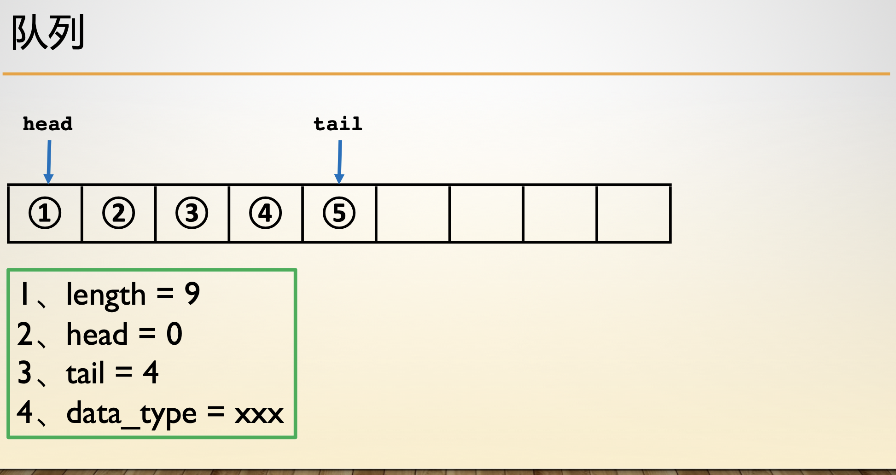

- [队列结构](#队列结构)
- [队列构建](#队列构建)
- [队列出队](#队列出队)
- [队列入队](#队列入队)
- [队列假溢出](#队列假溢出)
- [循环队列](#循环队列)

## 队列结构

```c
typedef struct Queue {
    int *data;
    int head, tail, length, count;
} Queue;
特点 //FIFO 先进先出
```


## 队列构建



```c
Queue *init(int n) {
    Queue *q = (Queue *)malloc(sizeof(Queue));
    q->data = (int *)malloc(sizeof(int) * n);
    q->length = n;
    q->count = 0;
    q->head = q->tail = 0;
    return q;
}
```


## 队列出队


```
void pop(Queue *q) {
    q->head += 1;
    if (q->head >= q->length) q->head -= q->length;
    q->count -= 1;
    return ;
}
```


## 队列入队


```
void push(Queue *q, int val) {
    if (q->count == q->length) return ;
    q->data[(q->tail)++] = val;
    if (q->tail >= q->length) q->tail -= q->length;
    q->count += 1;
    return ;
}
```


## 队列假溢出


## 循环队列

